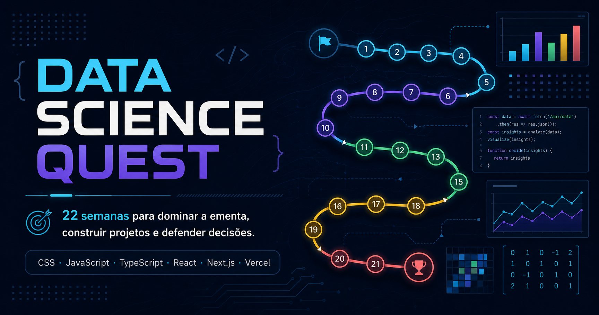

# Data Science Quest



Hub pessoal de preparação para o processo seletivo de Cientista de Dados do Itaú Unibanco. O produto transforma a ementa oficial e o roadmap v12 em uma jornada prática de **22 semanas**, entre **03/08/2026 e 31/12/2026**, com domínio, prática, revisão e portfólio no mesmo lugar.

[](https://nextjs.org/)
[](https://react.dev/)
[](https://www.typescriptlang.org/)
[](https://vercel.com/)
[](LICENSE)

## Funcionalidades

- tabuleiro visual com 22 semanas, 12 blocos e estados de domínio;
- central detalhada de cada semana com ementa, conteúdo, materiais, projeto e sabatina;
- auditoria automática de 72 itens oficiais, 22 projetos, 220 perguntas e 220 respostas;
- status vermelho, amarelo, verde e revisão, sem concluir conteúdo automaticamente;
- Pomodoro integrado ao histórico real de estudo e ao cálculo de XP;
- editor privado com Markdown, tabelas, código, fórmulas LaTeX, trechos curtos e imagens;
- imagens guardadas no IndexedDB do dispositivo, sem base64 no JSON das notas;
- flashcards derivados do dicionário canônico de sabatina;
- sabatina com resposta oculta, tentativa e autoavaliação;
- simulador de prova prática de até quatro horas;
- acompanhamento dos 22 repositórios de portfólio;
- analytics alimentados apenas pelos registros reais do usuário;
- caderno de erros, conquistas, busca global e modo claro/escuro;
- backup JSON dos dados pessoais;
- layout responsivo com sidebar no desktop e navegação inferior no celular.

## Stack

| Camada | Tecnologia |
|---|---|
| Interface | CSS moderno, Tailwind CSS 4, Lucide Icons |
| Linguagem | JavaScript e TypeScript 5.9 em modo estrito |
| Aplicação | React 19.2 e Next.js 16.3 com App Router |
| Conteúdo rico | React Markdown, GFM, KaTeX e LaTeX |
| Visualização | Recharts |
| Persistência visitante | localStorage para dados estruturados e IndexedDB para imagens |
| Qualidade | ESLint, TypeScript, testes nativos do Node e auditoria de conteúdo |
| Publicação | GitHub Actions e Vercel |

## Arquitetura

```text
app/                    rotas, metadata, manifest, sitemap e robots
components/             tabuleiro Quest e módulos de estudo
data/roadmap-v12.md     fonte canônica do roadmap
data/roadmap.json       conteúdo estruturado e auditado
lib/quest-data.ts       tipos, estados, datas e paleta dos blocos
lib/use-quest-workspace.ts
                        estado privado e persistência local
lib/local-assets.ts     imagens privadas no IndexedDB
scripts/                geração e validação do conteúdo
tests/                  integridade da aplicação e do roadmap
public/                 assets públicos e Open Graph
```

O conteúdo canônico é separado dos dados pessoais. O roadmap pode ser publicado; notas, sessões, respostas, erros e imagens continuam no navegador do usuário. A troca futura do adaptador local por Supabase não exige alterar os componentes de domínio.

## Fontes de verdade e seed

- `data/roadmap-v12.md`: distribuição canônica do conteúdo por semana;
- `data/roadmap.json`: saída estruturada gerada pelo script de importação;
- ementa original do processo seletivo: referência de integridade dos 72 itens.

Atualize ou valide o seed com:

```bash
npm run content:audit
```

A auditoria falha se não encontrar exatamente 22 semanas, 12 blocos, 72 itens oficiais, 22 projetos, 220 perguntas e 220 respostas.

## Desenvolvimento local

Requisitos: Node.js 22.13 ou superior e npm.

```bash
git clone https://github.com/anitacr/data-science-quest-roadmap.git
cd data-science-quest-roadmap
cp .env.example .env.local
npm ci
npm run content:audit
npm run dev
```

Abra `http://localhost:3000`.

No PowerShell, use `Copy-Item .env.example .env.local` no lugar de `cp`.

## Variáveis de ambiente

| Variável | Obrigatória | Uso |
|---|---:|---|
| `NEXT_PUBLIC_APP_URL` | recomendada | URL canônica, metadata e sitemap |
| `NEXT_PUBLIC_SUPABASE_URL` | não | reservada para sincronização com Supabase |
| `NEXT_PUBLIC_SUPABASE_ANON_KEY` | não | chave pública do cliente Supabase |
| `SUPABASE_SERVICE_ROLE_KEY` | não | somente no servidor; nunca expor no navegador |
| `AI_PROVIDER` | não | padrão `heuristic`, sem serviço pago |
| `AI_API_KEY` | não | provedor remoto opcional, apenas no servidor |
| `AI_MODEL` | não | modelo remoto opcional |
| `GITHUB_TOKEN` | não | integração GitHub opcional, apenas no servidor |

O site funciona sem qualquer chave no modo visitante local.

## Supabase

O deploy atual usa o modo visitante definido no prompt: dados estruturados ficam no `localStorage` e imagens no IndexedDB, sempre isolados por navegador. As variáveis de Supabase já estão documentadas para a evolução de sincronização entre dispositivos, magic link, Storage privado e Row Level Security.

Enquanto um projeto Supabase não estiver configurado, não informe as chaves e não exponha uma `service role` no cliente. O modo local continua totalmente funcional e pode ser exportado em **Configurações → Backup pessoal**.

## Testes e qualidade

```bash
npm run lint
npm run typecheck
npm test
```

`npm test` executa a auditoria do roadmap, checagem de tipos, build de produção e testes de integridade. O workflow em `.github/workflows/ci.yml` repete essas verificações em pushes e pull requests.

## Deploy na Vercel

### Integração GitHub — recomendada

1. Importe `anitacr/data-science-quest-roadmap` na Vercel.
2. Mantenha o preset **Next.js** e os comandos detectados automaticamente.
3. Configure `NEXT_PUBLIC_APP_URL` com a URL de produção.
4. Publique a branch `main`.

Cada pull request recebe um preview; a produção acompanha a branch `main`.

### Vercel CLI

```bash
npx vercel
npx vercel --prod
```

O nome desejado do projeto é `data-science-quest-roadmap`, resultando em `https://data-science-quest-roadmap.vercel.app` quando disponível.

## Segurança e privacidade

- nenhum token, chave ou PDF protegido é versionado;
- as funcionalidades principais não dependem de IA paga;
- dados pessoais não são enviados a um backend no modo visitante;
- imagens ficam como `Blob` no IndexedDB, com limite de 8 MB e tipos controlados;
- respostas da sabatina só aparecem depois da tentativa;
- analytics não usam números fictícios;
- backups contêm apenas os registros pessoais do navegador;
- materiais externos mantêm seus próprios direitos autorais.

Para usar o site em computador público, exporte o backup se necessário e limpe os dados do navegador ao terminar.

## Rotas

As rotas solicitadas no prompt são atendidas pelo App Router, incluindo `/roadmap`, `/blocos`, `/semanas/[numero]`, `/ementa`, `/pomodoro`, `/anotacoes`, `/flashcards`, `/sabatina`, `/prova-pratica`, `/projetos`, `/analytics`, `/caderno-de-erros`, `/conquistas`, `/configuracoes` e `/portfolio`.

## Roadmap do produto

- [x] conteúdo integral e auditoria canônica;
- [x] tabuleiro Quest e centrais de semana;
- [x] domínio, sessões, Pomodoro, notas, imagens, sabatina e projetos;
- [x] analytics reais, erros, conquistas, backup e responsividade;
- [x] build Next.js nativo e preparação para Vercel/GitHub Actions;
- [ ] sincronização opcional entre dispositivos com Supabase Auth, Storage e RLS;
- [ ] importação e exportação CSV compatível com Anki;
- [ ] integração GitHub server-side opcional.

## Créditos, direitos autorais e licença

O conteúdo de estudo foi organizado a partir da ementa fornecida pelo candidato e do roadmap v12. Os PDFs e livros protegidos **não são distribuídos neste repositório**. O editor registra somente referências, páginas, capítulos, links, trechos curtos necessários e anotações próprias.

Código sob a [licença MIT](LICENSE). Materiais externos preservam suas próprias licenças e direitos autorais.
